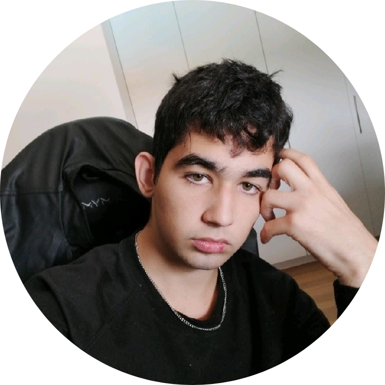

# Olá, pode me chamar de Felipe :)

  
  
  
  
  
  

🖥 Eu sou um estudante autodidata de desenvolvimento web, artes digitais e marketing empresarial;

🤵 Atualmente trabalho na Schaeffler como aprendiz administrativo e curso Administração no SENAI; 

❤ Amo jogar Valorant e sair com meus amigos. 

  &nbsp;
  &nbsp;
  &nbsp; 
  &nbsp;
  &nbsp;
  &nbsp;

---

  
  
  

